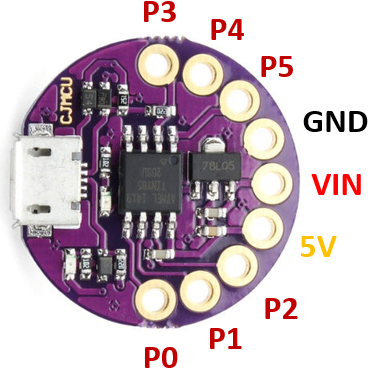
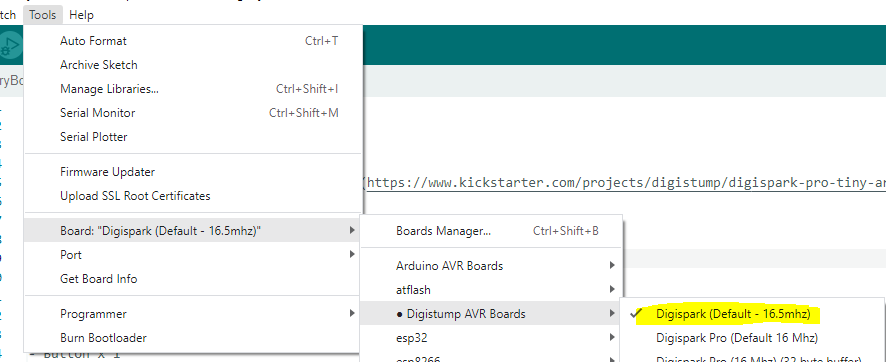

# Digispark Kickstarter ATTiny85

ModelA:\


Mini LilyPadATtiny85 CJMCU\


## Mô tả

- CPU: ATTiny85
- Tần số xung nhịp: 16 mHz
- Flash memory: 5.87KB
- RAM: 512B


## Lập trình

- LED_BUILDIN  được nối với chân PB1 (đã kiểm tra) và nằm ở vị trí gần chân PB3

```arduino
#define LED_BUILDIN 1
```

- Với Arduino IDE:
  - Thêm thông tin về board mới:
    > <http://digistump.com/package_digistump_index.json>
  - Chọn board: Digispark (Default - 16 mhz)\
    
- Với Visual Studio Code + PlatformIO
  - Chọn board:
    
  - Cấu hình PlatformIO

    ```yaml
    [env:digispark-tiny]
    platform = atmelavr
    board = digispark-tiny
    ; change microcontroller
    board_build.mcu = attiny85
    ; change MCU frequency
    board_build.f_cpu = 16500000L
    ```

- Điều khiển servo không sử dụng lib mặc định *Servo.h*. Có thể sử dụng lib [SoftServo](https://github.com/GyverLibs/SoftServo)

## Thông số chi tiết
>
> CPU: ATTiny85
> Tần số xung nhịp: 16 mHz

- Flash memory: 5.87KB
- RAM: 512B
- Nguồn cấp:
  - USB
  - Vin với dải điện áp 5-7.35V
- **Các chân vào ra phải làm việc ở điện áp 3.3V**
- Nhà sản xuất: [Digistump](http://digistump.com/products/1?utm_source=platformio.org&utm_medium=docs)


Tham khảo: <https://docs.platformio.org/en/latest/boards/atmelavr/digispark-tiny.html?utm_source=platformio&utm_medium=piohome>

### Tra cứu bản đồ địa chỉ bộ nhớ


## Demo

  [Video](https://youtu.be/Xo8rYATKyDA?si=4_hPLh-KgOdXgbzL)
  
## Vỏ in 3D

- Dạng đầu USB đực: <https://www.thingiverse.com/thing:3303209>
- Dạng đầu USB đực: <https://www.thingiverse.com/thing:3494815>

## Mua

- Shopee: <https://shopee.vn/product/578443443/16168780247?gad_source=1&gclid=EAIaIQobChMI37nak8HpgwMV49AWBR1BYg8UEAQYASABEgLB5vD_BwE>
- <https://linhkienvietnam.vn/module-node-mcu-32s-esp32-devkitc-dung-module-esp-wroom-32>
