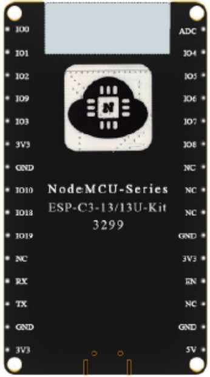

# NodeMCU ESP32-C3-01M-Kit

  
  

## Mô tả

- MCU: Module ESP32-C3 13U
- Flash: 4M

## Lập trình

```C
  #define PIN_LEDRGB_RED   3  //Tích cực mức cao
  #define PIN_LEDRGB_GREEN 4  //Tích cực mức cao
  #define PIN_LEDRGB_BLUE  5  //Tích cực mức cao

  #define PIN_LED2   18       //Màu vàng, tích cực mức cao
  #define PIN_LED3   19       //Màu trắng, tích cực mức cao
```

> Dường như pin 0 không thể làm Input được.


## Chi tiết



- [Xem datasheet](https://www.farnell.com/datasheets/3621268.pdf)

## Mua sắm

- [Shopee](https://shopee.vn/B%E1%BA%A3ng-M%E1%BA%A1ch-Ph%C3%A1t-Tri%E1%BB%83n-Kh%C3%B4ng-D%C3%A2y-Esp32-C3-Esp-C3-01M-Esp32-C3-01m-Ble5.0-i.81431289.10837066439?sp_atk=371773be-f05e-441e-93c0-c6c534684a50&xptdk=371773be-f05e-441e-93c0-c6c534684a50)

