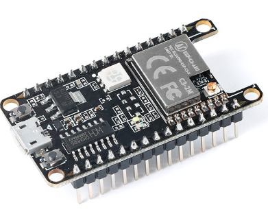
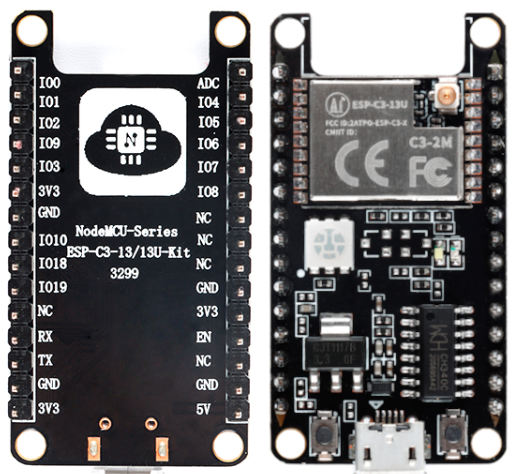

# NodeMCU ESP32-C3-13U-Kit

  
  

## Mô tả

- MCU: Module ESP32-C3 13U 
- Flash: 4M

## Lập trình

- Y hệt như Esp32-C3 Super mini

```C
  #define BOOT_BUTTON_PIN   9  # Nút bấm Boot để nạp nạp code khi khởi động, hoặc cho mục đích tùy ý sau đó
  #define LEDRGB_PIN        8  # Đèn  LED 3 màu WS2812
  #define TX_PIN           21  # Chân TX mặc định, kèm đèn led đỏ
  #define RX_PIN           20  # Chân TX mặc định, kèm đèn led xanh
  #define RED_LED_PIN      21  # Chân TX mặc định, kèm đèn led đỏ
  #define BLUE_LED_PIN     20  # Chân TX mặc định, kèm đèn led xanh
```

## Thông số chi tiết

