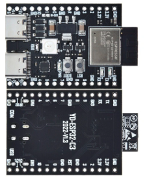
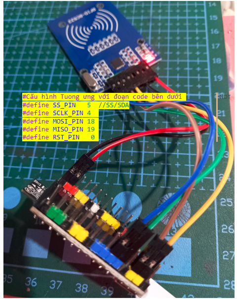

# ESP32-C3 DevKitM 1 Dual USB

  

## Mô tả

- MCU: ESP32-C3
- Có 2 cổng USB Type C:
  - Cổng USB có chữ COM, đã được chuyển đổi thành Serial,  dùng để nạp code và giao tiếp với máy tính như các loại Dev-Kit khác
  - Cổng USB có chữ USB, dạng native, dùng để biến Dev-Kit thành thiết bị dạng HID kết nối với máy tính
    - <mark> Ưu điểm nổi bật: cho phép debug step-by-step mà không cần thiết bị bổ trợ. Đã thử nghiệm thành công với Visual Studio Code. </mark>

## Lập trình

- Ngôn ngữ lập trình:
- Công cụ lập trình: Arduino IDE, Visual Studio Code + PlatformIO
- Nút bấm BOOT có trên board được nối sẵn ở GPIO**9**
- LED RGB được nối sẵn ở GPIO**8**
- Có 2 đèn led đơn sắc tích hợp sẵn tren board, ở 2 chân TX, RX, đồng thời có thể dùng độc lập

```C
  #define BOOT_BUTTON_PIN   9  # Nút bấm Boot để nạp nạp code khi khởi động, hoặc cho mục đích tùy ý sau đó
  #define LEDRGB_PIN        8  # Đèn  LED 3 màu WS2812
  #define TX_PIN           21  # Chân TX mặc định, kèm đèn led đỏ
  #define RX_PIN           20  # Chân TX mặc định, kèm đèn led xanh
  #define RED_LED_PIN      21  # Chân TX mặc định, kèm đèn led đỏ
  #define BLUE_LED_PIN     20  # Chân TX mặc định, kèm đèn led xanh
```

### Với Arduino IDE:
  
- Chọn board: **ESP32C3 Dev Module**
  
  
### Với Visual Studio Code

- Chọn board: esp32-c3-devkitm-1\
  
- Cấu hình PlatformIO\

  ```yaml
  [env:esp32-c3-devkitm-1]
  build_type = debug
  platform = espressif32
  board = esp32-c3-devkitm-1
  framework = arduino
  debug_tool = esp-builtin
  monitor_speed = 115200

## Thông số chi tiết

  

- [Tài liệu của hãng Espressif](https://docs.espressif.com/projects/esp-idf/en/stable/esp32c3/hw-reference/esp32c3/user-guide-devkitm-1.html)

## Demo với SPI

Thử nghiệm thành công việc đổi các chân pin SPI để chứng minh rằng ESP32-C3 có thể tùy ý lây bất cứ chân nào làm SPI.

Ví dụ cách 1:

Ví dụ cách 2:

> Chú ý:
>
> - Chân Reset của SPI không quan trọng. Đăt = 0 la được
> - Nếu 1 chân của SPI bị lỏng và rụng ==> thì phải reset lại toàn bộ thiết bị SPI bằng cách reboot lại bo mạch chính
> - Nếu đèn nguồn D1 màu đỏ tren RC522 bị sáng mờ thì cũng có nghia là bị lỏng chân, phải reboot lại bo mạch chính

Cấu hình board PlatformIO\

  ```yaml
  [env:esp32-c3-devkitm-1]
  build_type = release
  platform = espressif32
  board = esp32-c3-devkitm-1
  framework = arduino
  debug_tool = esp-builtin
  monitor_speed = 115200
  lib_deps = 
    miguelbalboa/MFRC522@^1.4.10
  
Code mẫu:\

  ```C
    #include <Arduino.h>
    #include <SPI.h>
    #include <MFRC522.h>
    
    //  Các tổ hợp vị tri SPI đã thử thành công
    #define SS_PIN   5  // 19 //  19 // 10     //SS/SDA
    #define SCLK_PIN 4  // 18 //  18 //  6   
    #define MOSI_PIN 18 // 5 //  5  //  7   
    #define MISO_PIN 19 // 4 //  4  //  2   
    #define RST_PIN   0 // 0 //  0  //  0         
    
      
    MFRC522 rfid(SS_PIN, RST_PIN); // Instance of the class
    MFRC522::MIFARE_Key key; 
    // Init array that will store new NUID 
    byte nuidPICC[4];
    
    /**
      * Helper routine to dump a byte array as hex values to Serial. 
      */
    void printHex(byte *buffer, byte bufferSize) {
      for (byte i = 0; i < bufferSize; i++) {
        Serial.print(buffer[i] < 0x10 ? " 0" : " ");
        Serial.print(buffer[i], HEX);
      }
    }
    /**
      * Helper routine to dump a byte array as dec values to Serial.
      */
    void printDec(byte *buffer, byte bufferSize) {
      for (byte i = 0; i < bufferSize; i++) {
        Serial.print(buffer[i] < 0x10 ? " 0" : " ");
        Serial.print(buffer[i], DEC);
      }
    }
    void setup() { 
      Serial.begin(9600);
      //SPI.begin(); // Init SPI bus
      SPI.begin(SCLK_PIN, MISO_PIN, MOSI_PIN, SS_PIN);
      rfid.PCD_Init(); // Init MFRC522 
      for (byte i = 0; i < 6; i++) {
        key.keyByte[i] = 0xFF;
      }
      Serial.println(F("This code scan the MIFARE Classsic NUID."));
      Serial.print(F("Using the following key:"));
      printHex(key.keyByte, MFRC522::MF_KEY_SIZE);
    }
      
    void loop() {
      // Reset the loop if no new card present on the sensor/reader. This saves the entire process when idle.
      if ( ! rfid.PICC_IsNewCardPresent())
        return;
      // Verify if the NUID has been readed
      if ( ! rfid.PICC_ReadCardSerial())
        return;
      Serial.print(F("PICC type: "));
      MFRC522::PICC_Type piccType = rfid.PICC_GetType(rfid.uid.sak);
      Serial.println(rfid.PICC_GetTypeName(piccType));
      // Check is the PICC of Classic MIFARE type
      if (piccType != MFRC522::PICC_TYPE_MIFARE_MINI && 
        piccType != MFRC522::PICC_TYPE_MIFARE_1K &&
        piccType != MFRC522::PICC_TYPE_MIFARE_4K) {
        Serial.println(F("Your tag is not of type MIFARE Classic."));
        return;
      }
      if (rfid.uid.uidByte[0] != nuidPICC[0] || 
        rfid.uid.uidByte[1] != nuidPICC[1] || 
        rfid.uid.uidByte[2] != nuidPICC[2] || 
        rfid.uid.uidByte[3] != nuidPICC[3] ) {
        Serial.println(F("A new card has been detected."));
        // Store NUID into nuidPICC array
        for (byte i = 0; i < 4; i++) {
          nuidPICC[i] = rfid.uid.uidByte[i];
        }
        
        Serial.println(F("The NUID tag is:"));
        Serial.print(F("In hex: "));
        printHex(rfid.uid.uidByte, rfid.uid.size);
        Serial.println();
        Serial.print(F("In dec: "));
        printDec(rfid.uid.uidByte, rfid.uid.size);
        Serial.println();
      }
      else Serial.println(F("Card read previously."));
      // Halt PICC
      rfid.PICC_HaltA();
      // Stop encryption on PCD
      rfid.PCD_StopCrypto1();
  }
  ```

## Demo với I2C


Porting trong mã nguồn như sau\

```C
  // Giao tiếp I2C
  #define I2C_SCL 2
  #define I2C_SDA 3
  void setup() {
    Wire.begin(I2C_SDA, I2C_SCL);
  }
```

## Thiết kế board

- [Symbol tại EasyEDA](https://easyeda.com/editor#id=18961e98ec4a40d898f9f249758cc22e|a9d5eabad4db46ad94d932aa7da6334e|!389fa6d92786445fac4a9a934dfa8232|!723191762e9c490cbc8dd6448162145e)
  

- [Footprint tại EasyEDA](https://easyeda.com/editor#id=18961e98ec4a40d898f9f249758cc22e|a9d5eabad4db46ad94d932aa7da6334e|!389fa6d92786445fac4a9a934dfa8232)
  


## Mua sắm

- [Shopee](https://shopee.vn/B%E1%BA%A3ng-M%E1%BA%A1ch-Ph%C3%A1t-Tri%E1%BB%83n-Lo%E1%BA%A1i-C-ESP32-ESP32-C3-ESP32-S3-ESP32-C3-C3-DevKitM-1-ESP32-C3-MINI-1-ESP32-S3-DevKit-C-N16R8-i.770245757.20363483969?sp_atk=55ab357f-ed60-48bb-bc5e-dbad34444041&xptdk=55ab357f-ed60-48bb-bc5e-dbad34444041)
