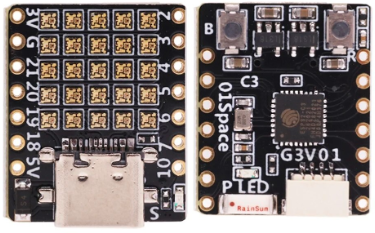

# ESP32-C3FH4 RGB

  

## Mô tả

- MCU: ESP32-C3
- Kích thước: 21 x 18 mm
- Nặng: 2.3g

## Lập trình

- Ngôn ngữ lập trình: C, Python
- Công cụ lập trình: Arduino IDE, Visual Studio Code + PlatformIO, Visual Studio Code + DeviceScript
- LED RGB được nối sẵn ở GPIO**8**
  
  ```C
  #define LEDMATRIX_PIN   8  // Ma trận led 5x5 WS2812B
  #define STATUS_LED_PIN 10  // LED xanh dương, báo trạng thái
  #define BOOT_BUTTON_PIN 9  // Nút bấm B/Boot 
  #define I2C_SCL_PIN 1      // i2c.pinSCL, analogIn, io
  #define I2C_SCA_PIN 9      // i2c.pinSDA, analogIn, io
  ```


- Để nạp code, phải tiến hành cài đặt driver với [**zadig**](https://zadig.akeo.ie)

### Với Arduino IDE

- Chọn board: **ESP32C3 Dev Module**
  

- Thiết lập giao tiếp Serial

  ```plain
  CDC enable on boot: true
  ```

- Khi nạp code, phải đưa MCU vào trạng thái nạp code bằng cách
  1. Bấm và giữ nút **Boot**.
  2. Bấm và nhả nút **Reset**. Nhưng chú ý phải tiếp tục giữ nút **Boot**.
  3. Tiến hành nạp code từ Arduino IDE, tiếp tục giữ nút **Boot**.
  4. Đợi cho tới khi Arduino IDE báo đã kết nối. Lúc này có thể nhả nút **Boot**.

### Với Visual Studio Code + PlatformIO

- Chọn board: esp32-c3-devkitm-1\
  
- Cấu hình PlatformIO

  ```yaml
  [env:esp32-c3-devkitm-1]
  build_type = debug
  platform = espressif32
  board = esp32-c3-devkitm-1
  framework = arduino
  debug_tool = esp-builtin
  monitor_speed = 115200
  ```

### Với Visual Studio Code + DeviceScript

- Xem chi tiết tại <https://microsoft.github.io/devicescript/devices/esp32/esp32-c3fh4-rgb>

## Thông số chi tiết

- Tên board: C3FH4 RGB board
- MCU: RISC-V core tần số xung nhịp: 160 MHz, 
- Bộ nhớ chương trìnhL 4MB flash
- Wi-Fi: 2.4GHz Wi-Fi
- Bluetooth 5 LE with Long-Range support
- Ceramic antenna
- Màn hình LED: 25 đèn led WS2812B-1515 RGB LEDs được bố trí thành ma trận 5×5
- USB – 1x USB Type-C port for power and programming via CH340E USB to TTL chip
- Expansion – 2x 7-pin headers with up to 11x GPIOs, 5V, 3.3V, GND
- Có 2 nút bấm Reset và Boot
- Có 2 led báo nguồn cấp và led báo trạng thái
- 1 Qwiic connector với giao thức I2C
- Giao diện nối tiếp Serial ở pin 21 với tốc độ 115200 8N1

|pin name|hardware|id	features|
|--|--|--|
LEDS|GPIO8|boot, io|
|P2|GPIO2|analogIn, boot, io|
|P20|GPIO20|bootUart, io|
|P3|GPIO3|analogIn, io|
|P4|GPIO4|analogIn, debug, io|
|P5|GPIO5|debug, io|
|P6|GPIO6|debug, io|
|P7|GPIO7|debug, io|
|$services.buttonBOOT[0].pin|GPIO9|$services.buttonBOOT[0].pin, boot, io|
|i2c.pinSCL|GPIO1|i2c.pinSCL, analogIn, io|
|i2c.pinSDA|GPIO0|i2c.pinSDA, analogIn, io|
|led.pin|GPIO10|led.pin, io|
|log.pinTX|GPIO21|log.pinTX, bootUart, io|

## Demo

- Code mẫu: <https://github.com/01Space/ESP32-C3FH4-RGB>
- Trong đó chương trình xuất xưởng là ESP32-C3FH4-RGB/strandtest_wheel ở đây [strandtest_wheel](https://github.com/01Space/ESP32-C3FH4-RGB/tree/main/strandtest_wheel)

- Code mẫu từ Microsoft: <https://microsoft.github.io/devicescript/devices/esp32/esp32-c3fh4-rgb>

## Mua sắm

- [AliExpress](https://www.aliexpress.com/item/1005006160374948.html)
- [banggood](https://sea.banggood.com/ESP32-C3-Development-Board-RISC-V-WiFi-Bluetooth-IoT-Development-Board-Compatible-with-Python-p-1914005.html)
