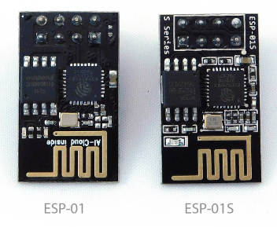
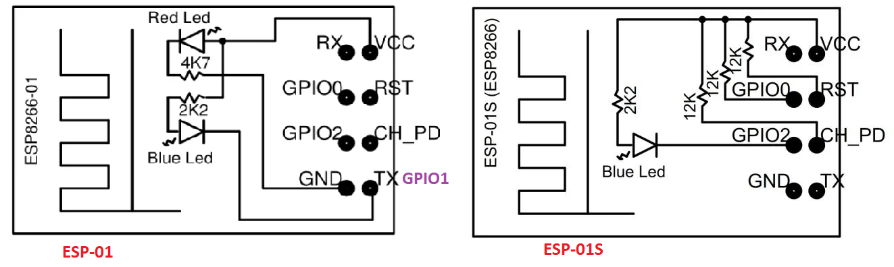
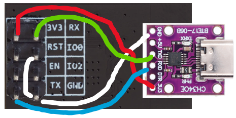
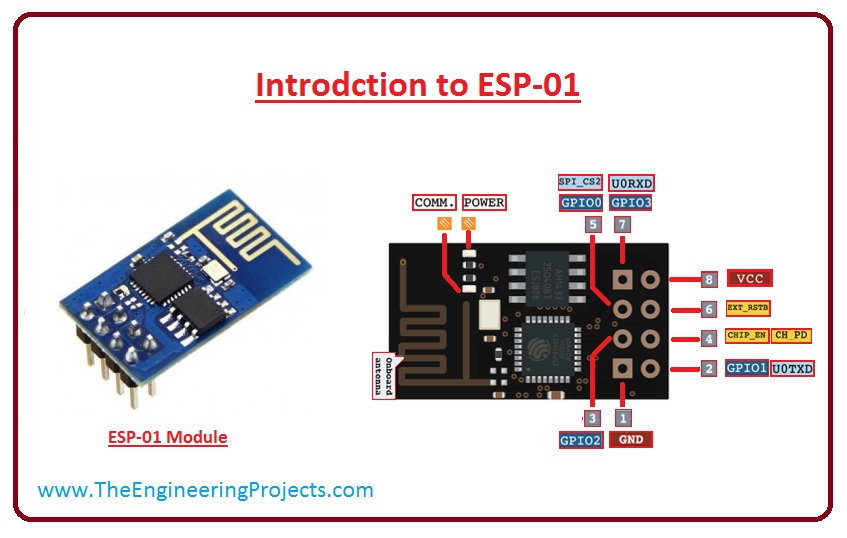
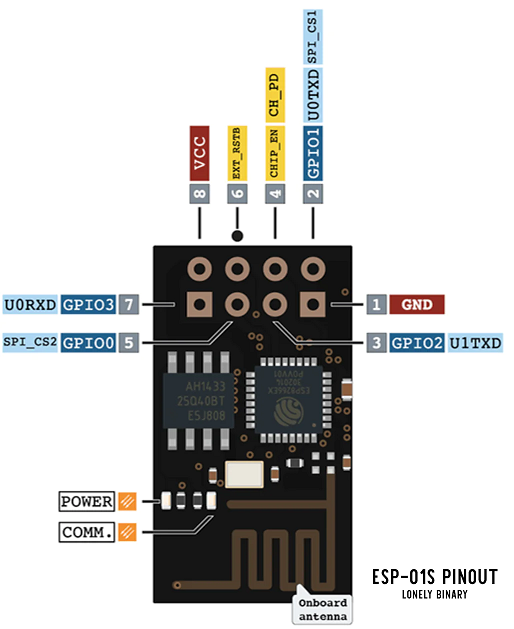
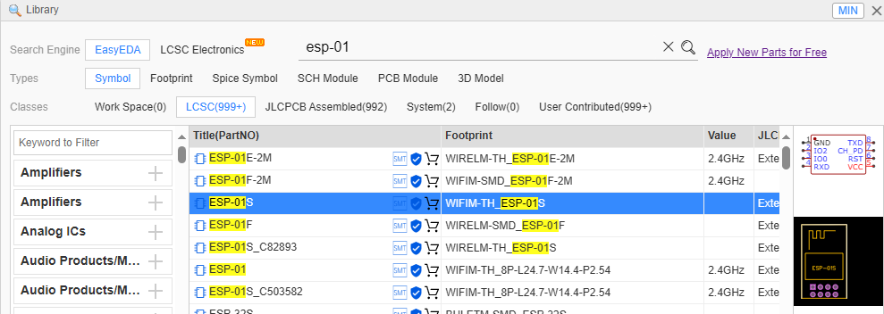
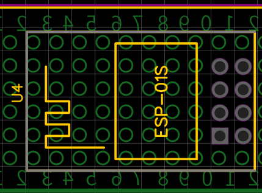

# ESP-01 và ESP-01S

## Mô tả



> Nên dùng ESP-01S vì có lớp vẽ kí hiệu *top silk* và *bottom silk* dễ nhìn hơn. Đồng thời xem thêm [bên dưới](#khác-biệt-esp-01-vs-esp-01s)

## Lập trình

- Ngôn ngữ lập trình:
- Công cụ lập trình: Arduino IDE, Visual Studio Code + PlatformIO
- LED_BUILDIN  được nối với chân GPIO01 với module ESP-01, và chân GPIO02 với module ESP-01S
> Do điều kiện xác định chế độ nạp code là  **(Mới reset) and (GPIO0 = GND)** nên không được sử dụng GPIO0 để nối với module có pull-down. Ví dụ GPIO0 gắn với chân Echo của [SR-04](https://neittien0110.github.io/linhkiendientu/#%C4%91o-kho%E1%BA%A3ng-c%C3%A1ch) thì MCU sẽ không chạy được, vì chân Echo sẽ luôn được SR-04 kéo về 0.
  
  ```C
  //Với ESP-01
  #define LED_BUILDIN 1
  //Với ESP-01S
  #define LED_BUILDIN 2
  // và phân chung
  #define GPI01 1
  #define GPI03 3
  #define TX 1
  #define RX 3
  ```



- Với Arduino IDE:
  - Chọn board: Generic ESP8266 Module\

    ```text
    2. Select; Tools -> Flash Mode: -> 'DIO'
    3. Select; Tools -> Flash Frequency: -> '40MHz'
    4. Select; Tools -> CPU Frequency: -> '80 MHz'
    5. Select; Tools -> Flash Size: -> '512K (64K SPIFFS)'
    6. Select; Tools -> Debug Port: -> 'Disabled'
    7. Select; Tools -> Debug Level: -> 'None'
    8. Select; Tools -> Reset Method: -> 'ck'
    9. Select; Tools -> Upload Speed: -> '115200'  
    ```

- Với Visual Studio Code: [chi tiết](https://docs.platformio.org/en/latest/boards/espressif8266/esp01.html)
  - Chọn board: esp01
  - Cấu hình PlatformIO\

    ```env
    [env:esp01]
    platform = espressif8266
    board = esp01  
    ```

## Nạp code

**CÁCH 1: dùng bộ chuyển đổi uart2usb**
1. Chân **CH_PD=GPIO 0** phải bằng 0, GND, để ESP-01(S) ở trạng thái nạp code.
2. Bởi vì không có nút Reset, nên trước khi nạp code phải unplug MCU với nguồn, rồi cắm lại (như vậy thì GPIO = 0 mới có tác dụng khi boot để đưa MCU vào trạng thái nạp code)\


**CÁCH 2: giống cách 1, chỉ đơn giản hơn ở cái socket**
[Mua bộ này có sẵn nút bấm](https://shopee.vn/M%C3%B4-%C4%90un-T%E1%BA%A3i-Xu%E1%BB%91ng-CH340C-ESP8266-ESP-01-ESP-01S-Chuy%C3%AAn-D%E1%BB%A5ng-i.869927552.22538518490)


Trích nguồn <https://nshopvn.com/product/usb-adapter-mach-thu-phat-wifi-esp8266-uart-esp-01>

Xem thêm video [hướng dẫn 4 cách nạp code](https://www.youtube.com/watch?v=HqEAyOf7rqQ)


## Thông số chi tiết

- Điện áp sử dụng: 3.3VDC
- Điện áp giao tiếp: 3.3VDC
- Dòng tiêu thụ: Max 320mA (nên sử dụng module cấp nguồn riêng cho mạch).
- Hỗ trợ chuẩn 802.11 b/g/n.
- Wi-Fi 2.4 GHz, hỗ trợ các chuẩn bảo mật như: OPEN, WEP, WPA_PSK, WPA2_PSK, WPA_WPA2_PSK.
- Hỗ trợ cả 2 giao tiếp TCP và UDP.
- Chuẩn giao tiếp UART với Firmware hỗ trợ bộ tập lệnh AT Command, tốc độ Baudrate mặc định 9600 hoặc 115200.
- Có 3 chế độ hoạt động: Client, Access Point, Both Client and Access Point.
- Kích thước: 24.8 x 14.3mm

- Chức năng của từng chân:
  - VCC: 3.3V , dòng có thể lên 300mA vì thế cần mạch nguồn riêng  ams1117 5V->3.3V 
  - GND: 0V
  - Tx: GPI01 Chân Tx của giao thức UART, kết nối đến chân Rx của vi điều khiển.
  - Rx: GPI03 Chân Rx của giao thức UART, kết nối đến chân Tx của vi điều khiển.
  - RST:  chân reset, tích cực mức thấp / 0 / GND.
  - **CH_PD**: CHip Power Down, cho phép thu phát wifi, tích cực mức cao / 1/ VCC. Chân này nếu được kéo lên mức cao module sẽ bắt đầu thu phát wifi, kéo xuống mức thấp module dừng phát wifi. Vì ESP8266 khởi động hút dòng lớn nên chúng ta giữ chân này ở mức 0V khi khởi động hệ thống của mình , sau 2 s hãy kéo chân CH_PD lên 3.3V, để đảm bảo module hoạt động ổn định.
  - **GPIO0**: kéo xuống thấp **=GND** cho chế độ upgrade firmware (nạp code).
  - GPIO2: không sử dụng.

>Lưu ý : KHÔNG cấp nguồn cho esp8266 v1 bằng nguồn 3.3v của mạch pl2302,cp2102,arduino uno, nano, mega.. có thể gây cháy mạch mà nên dùng các mạch nguồn ngoài.

**ESP-01**\
\
**ESP-01S**\
\

## Khác biệt ESP-01 VS ESP-01S

ESP-01 | ESP-01S
--|--
Chân Reset phải được pull-up|Chân Reset có pull-up bên trong, mặc định
Chân CH_PD phải được pull-up|Chân CH_PD có pull-up bên trong, mặc định


### Tra cứu bản đồ địa chỉ bộ nhớ

## Demo

```C
```

## Vỏ in 3D

## Mua

- [Shopee](https://shopee.vn/M%C3%B4-%C4%90un-Thu-Ph%C3%A1t-T%C3%ADn-Hi%E1%BB%87u-Kh%C3%B4ng-D%C3%A2y-ESP8266-ESP-01-ESP-01S-ESP-12E-ESP-12F-ESP-32-ESP-32S-2.4G-Cho-Arduino-i.812409307.20522645636)

## Schematic và PCB

  
  
