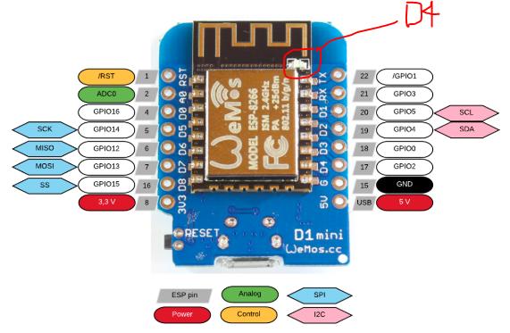
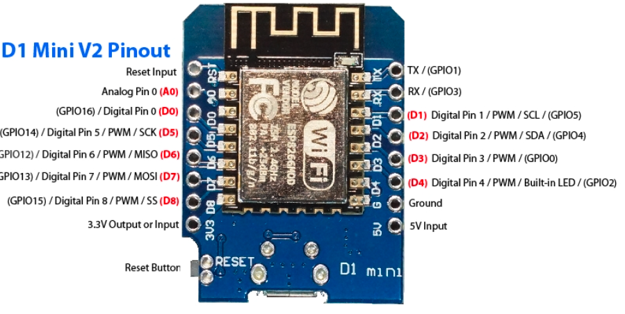

# WEMOS D1 R2 mini

## Mô tả


## Lập trình

- Ngôn ngữ lập trình:
- Công cụ lập trình: Arduino IDE, Visual Studio Code + PlatformIO
- LED_BUILDIN  được nối với chân D4, hoặc tên gọi khác là GPIO 2,
  
  ```C
  #define LED_BUILDIN D4  // hoặc
  #define LED_BUILDIN 2
  ```



- Với Arduino IDE:
  - Chọn board: .................
- Với Visual Studio Code:
  - Chọn board: .........................
  - Cấu hình PlatformIO\

  ```env
  ```

## Thông số chi tiết

- Footprint: <https://github.com/neittien0110/linhkiendientu/edit/master/EasyEDA_Library.md>
  


### Tra cứu bản đồ địa chỉ bộ nhớ

## Demo

```C
```

## Vỏ in 3D

## Mua
