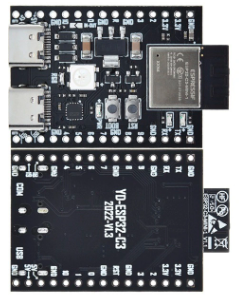
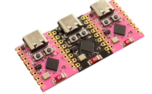
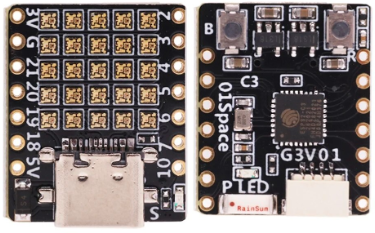
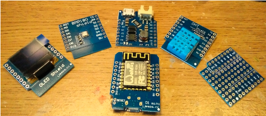
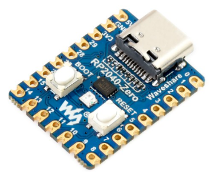

# MCU

Mô tả về các loại vi điều khiển Master Control Unit

## Các chỉ thị biên dịch

Các chỉ thị giúp thay đổi code tùy theo loại Board được chọn trên giao diện. [Xem ở đây](./preprocessor.vi.md). Ví dụ

```C
#if defined(AVR_UNO)
    /// Áp dùng khi board là Arduino UNO
#elif defined(ESP32C3_DEV)
    /// Áp dụng khi board là ESP32C3 DevKit Module
#endif       
```

## Họ ESP32 kiến trúc RISC-V

>Hiểu hơn về kiến trúc RISC-V. [Xem ở đây](https://neittien0110.github.io/RISC-VFundamentalMaterials)

1. [ESP32-C3 Dual USB](ESP32/ESP32-C3_DevKitM_1_dual_usb.md)\
    
2. [ESP32-C3 Super mini](ESP32/ESP32-C3_SuperMini.md)\
    
3. [ESP32-C3 FH4 LedBoard](ESP32/ESP32-C3_FH4_LedBoard.md)\
    

## Họ ESP32 kiến trúc ARM

1. [ESP32 Dev Kit V1](ESP32/ESP32_Dev_Kit_V1.md) \
   
2. [ESP32 Lite V1.0](ESP32/ESP32_Lite_V1.0.md)\
   
3. [Wemos Lolin S2 mini](ESP32/Lolin_S2_mini.md)\
   

## Họ ESP8266 ARM

1. [ESP8266 NodeMCU Ver 3](ESP8266/NodeMCU_V3.md)\
   
2. [ESP8266 D1 R2 mini](ESP8266/Wemosd1r2mini.md)\
   
3. [ESP-01 và ESP-01s](ESP8266/ESP01.md)\
   

## Họ ATTINY kiến trúc AVR

1. [Digispark Kichstarter ATTiny85](ATTiny/Digispark_Kickstarter_ATTiny85.md)\
   

## Họ RASBERRY PI kiến trúc ARM

1. [RasberryPi Zero RP2040](RasberryPi/RasberryPi-Zero-RP2040.md)\
   
