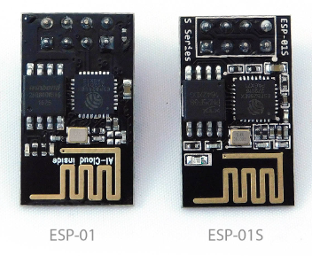

# MCU

Mô tả về các loại vi điều khiển Master Control Unit

## Mục lục

1. [Các chỉ thị biên dịch](#các-chỉ-thị-biên-dịch)
2. [Họ ESP32 kiến trúc RISC-V](#họ-esp32-kiến-trúc-risc-v)
3. [Họ ESP32 kiến trúc ARM](#họ-esp32-kiến-trúc-arm)
4. [Họ ESP8266](#họ-esp8266)
5. [Họ ATTINY kiến trúc AVR](#họ-attiny-kiến-trúc-avr)
6. [Họ RASBERRY PI kiến trúc ARM](#họ-rasberry-pi-kiến-trúc-arm)
7. [Họ CH32 kiến trúc RISC-V](#họ-ch32-kiến-trúc-risc-v)

Tham khảo các nội dung khác:

- [Bổ sung MCU mới vào ArduinoIDE](#thêm-mcu-mới-vào-arduinoide)
- [Linh kiện](https://neittien0110.github.io/linhkiendientu/)
- [Mạch sạc](https://neittien0110.github.io/linhkiendientu/EasyEDA_Library.html#m%E1%BA%A1ch-s%E1%BA%A1c)

## Các chỉ thị biên dịch

Các chỉ thị giúp thay đổi code tùy theo loại Board được chọn trên giao diện. Ví dụ

```C
#if defined(AVR_UNO)
    /// Áp dùng khi board là Arduino UNO
#elif defined(ESP32C3_DEV)
    /// Áp dụng khi board là ESP32C3 DevKit Module
#endif       
```

[Xem danh sách các chị thị xác định loại CPU ở đây](./preprocessor.vi.md).

## Họ ESP32 kiến trúc RISC-V

>Hiểu hơn về kiến trúc RISC-V. [Xem ở đây](https://neittien0110.github.io/RISC-VFundamentalMaterials)
ESP32 với 2 dòng series phổ biến là C3, và mới hơn là C6 sử dụng kiến trúc RISC-V.
ESP32-C3 với kiến trúc cụ thể là *RV32IMC*, pipeline 4 công đoạn, 32 vector ngắt với 7 mức ưu tiên [Datasheet](https://www.espressif.com/sites/default/files/documentation/esp32-c3_datasheet_en.pdf).
ESP32-C6, với kiến trúc cụ thể là *RV32IMAC*, pipeline 4 công đoạn, 28 vector ngắt ngoài với 16 mức ưu tiên và 2 chế độ M/U. [Datasheet](https://www.espressif.com/sites/default/files/documentation/esp32-c6_datasheet_en.pdf)


[Cách sử dụng USB-JTAG Debug đối với dòng C3](https://visualgdb.com/tutorials/esp32/esp32-c3/)

1. [ESP32-C3 Dual USB](ESP32/ESP32-C3_DevKitM_1_dual_usb.md)\
    
2. [ESP32-C3 Super mini](ESP32/ESP32-C3_SuperMini.md)\
    
3. [ESP32-C3 FH4 LedBoard](ESP32/ESP32-C3_FH4_LedBoard.md)\
    
4. [ESP32-C3-13U](ESP32/ESP32-C3_13U_Kit_NodeMCU.md)\
    
5. [Module MCU ESP32-C3-WROOM-02](ESP32/ESP32-C3-WROOM-02.md)\
   

7. [Module MCU ESP32-C6-WROOM-1](ESP32/ESP32-C6-WROOM-1.md)\
      

## Họ ESP32 kiến trúc ARM

1. [ESP32 Dev Kit V1](ESP32/ESP32_Dev_Kit_V1.md) \
   
2. [ESP32 Lite V1.0](ESP32/ESP32_Lite_V1.0.md)\
   
3. [Wemos Lolin S2 mini](ESP32/Lolin_S2_mini.md)\
   
4. [ESP32 kèm màn hình TFT 2.8" touch](ESP32/ESP32-TFT2,8.md)   \
   
5. [Module MCU ESP32-WROOM-32](ESP32/ESP32-WROOM-32.md)\
   
6. [Wemos Lolin32 với ESP32-WROOM-32 và màn oled built-in ](ES{32/ESP32-Oled-Wemos-Lolin32.md)\
    

   ESP32-WROOM-32.md

## Họ ESP8266

1. [ESP8266 NodeMCU Ver 3](ESP8266/NodeMCU_V3.md)\
   
2. [ESP8266 D1 R2 mini](ESP8266/Wemosd1r2mini.md)\
   
3. [ESP-01 và ESP-01s](ESP8266/ESP01.md)\
   
4. [ESP8266 NodeMCU có OLED tích hợp sẵn](ESP8266/ESP8266-Oled.md)\
   
   

## Họ ATTINY kiến trúc AVR

1. [Digispark Kichstarter ATTiny85](ATTiny/Digispark_Kickstarter_ATTiny85.md)\
   

## Họ RASBERRY PI kiến trúc ARM

1. [RasberryPi Zero RP2040](RasberryPi/RasberryPi-Zero-RP2040.md)\
   

## Họ CH32 kiến trúc RISC-V

1. [CH32V003](./CH32/CH32V003.md)\
   

## Thêm MCU mới vào ArduinoIDE

1. Trong Arduino IDE, chọn File/Properties (hoặc Ctrl+comma)\


2. Trong tab Settings, vào textbox Additional Boards Manager URLs và nhập vào các dòng cấu hình. Mỗi loại MCU trên một dòng. Sau đó, bấm **OK**. \
\
Ví dụ dòng khai báo sau cho các loại MCU:
   - Digistump AVR Boards: <https://raw.githubusercontent.com/digistump/arduino-boards-index/refs/heads/master/package_digistump_index.json>
      > Chú ý link <http://digistump.com/package_digistump_index.json> khồng còn sử dụng được từ 2024.
   - Espressif - ESP32: <https://raw.githubusercontent.com/espressif/arduino-esp32/gh-pages/package_esp32_index.json>
   - Espressif - ESP8266: <https://arduino.esp8266.com/stable/package_esp8266com_index.json>

3. Ở menu, chọn **Tools → Board:.. → Board Manager…**\


4. Tìm đúng tên board. Bấm **Install**.

