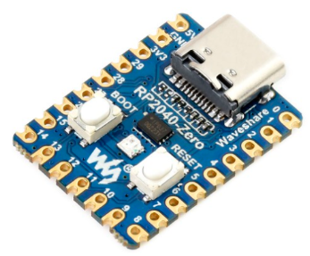

# RASBERRYPI ZERO



## Mô tả

- Dual-core ARM Cortex-M0+


## Lập trình

- Ngôn ngữ lập trình: C, Python
- Công cụ lập trình: Arduino IDE, Visual Studio Code + PlatformIO
- LED_BUILDIN  được nối với chân .....

```C
#define LED_BUILDIN ????
```

- Với Arduino IDE:
  - Chọn board: .................
- Với Visual Studio Code:
  - Chọn board: .........................
  - Cấu hình PlatformIO

```env
```

## Thông số chi tiết


- Chip vi điều khiển RP2040 được thiết kế bởi Raspberry Pi.
- Bộ xử lý Arm Cortex M0 + lõi kép, xung nhịp linh hoạt lên đến 133 MHz.
- 264KB SRAM và 2MB bộ nhớ Flash.
- Đầu nối USB-C chuẩn USB đang phổ biến hiện nay.
- Có chế độ ngủ năng lượng tiêu thụ thấp.
- Lập trình bằng cách kéo và thả thông qua các phần mềm hỗ trợ lập trình.
- 29 × chân GPIO đa chức năng.
- 2 × SPI, 2 × I2C, 2 × UART, 4 × 12-bit ADC, 16 × kênh PWM.
- 8 × I / O (PIO) có thể lập trình để hỗ trợ thiết bị ngoại vi.
- Phần mềm hỗ trợ lập trình C/C++, MicroPython.
- Nhiệt độ làm việc: -20°C to +85°C.

### Tra cứu bản đồ địa chỉ bộ nhớ

- [Pico Datasheet](https://datasheets.raspberrypi.com/pico/pico-datasheet.pdf)
- [Hướng dẫn lập trình bằng Python](https://datasheets.raspberrypi.com/pico/getting-started-with-pico.pdf)
- [Hướng dẫn lập trình C++](https://datasheets.raspberrypi.com/pico/raspberry-pi-pico-c-sdk.pdf)
- [RP2040 datasheet](https://datasheets.raspberrypi.com/rp2040/rp2040-datasheet.pdf)
- [Sơ đồ thiết kế schematic](https://datasheets.raspberrypi.com/rp2040/hardware-design-with-rp2040.pdf)

> Nguồn: <https://dientu360.com/raspberry-pi-rp2040-zero-mcu-rp2040-mini>

## Demo

```C
```

## Vỏ in 3D

## Mua sắm

- [Shopee]<https://shopee.vn/Bo-M%E1%BA%A1ch-Ph%C3%A1t-Tri%E1%BB%83n-RP2040-Zero-RP2040-Pi-PICO-L%C3%B5i-K%C3%A9p-Cortex-M0-Processor-2MB-Flash-i.812409307.22032443942>